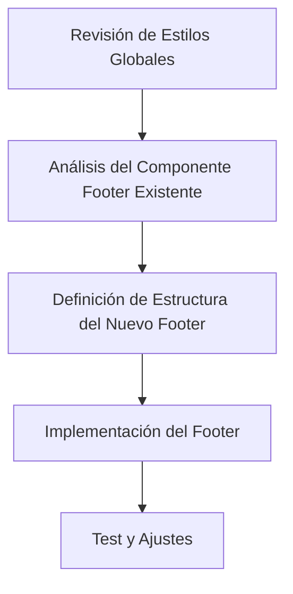

# Plan para Crear un Footer Acorde al Estilo de la Página y Responsivo

## Revisión del Estilo Global

- El archivo `globals.css` utiliza Tailwind CSS para los estilos base, componentes y utilidades.
- Se definen variables CSS para colores y otros estilos globales.
- El cuerpo (`body`) utiliza la fuente `Arial, Helvetica, sans-serif` y aplica los colores de fondo y texto definidos en las variables.

## Componentes Existentes

- El archivo `Footer.jsx` ya tiene una estructura básica con enlaces a redes sociales y un mensaje de derechos reservados.
- Utiliza íconos de `react-icons` y clases de Tailwind CSS para el diseño.

## Objetivo

- Crear un footer que mantenga la coherencia con el estilo global definido en `globals.css`.
- Asegurarse de que el footer sea responsivo y se vea bien tanto en dispositivos móviles como en pantallas grandes.

## Diagrama de Flujo (Mermaid)

## Estructura del Nuevo Footer

1. **Contenedor Principal**:

   - Utilizar la clase `footer` para el contenedor principal.
   - Aplicar clases de Tailwind CSS para el diseño responsivo.

2. **Sección de Enlaces Sociales**:

   - Mantener la estructura de enlaces sociales con íconos.
   - Asegurarse de que los enlaces sean accesibles y tengan etiquetas `aria-label`.

3. **Mensaje de Derechos Reservados**:
   - Incluir el mensaje de derechos reservados con el año actual.
   - Asegurarse de que el enlace al sitio web sea accesible.
